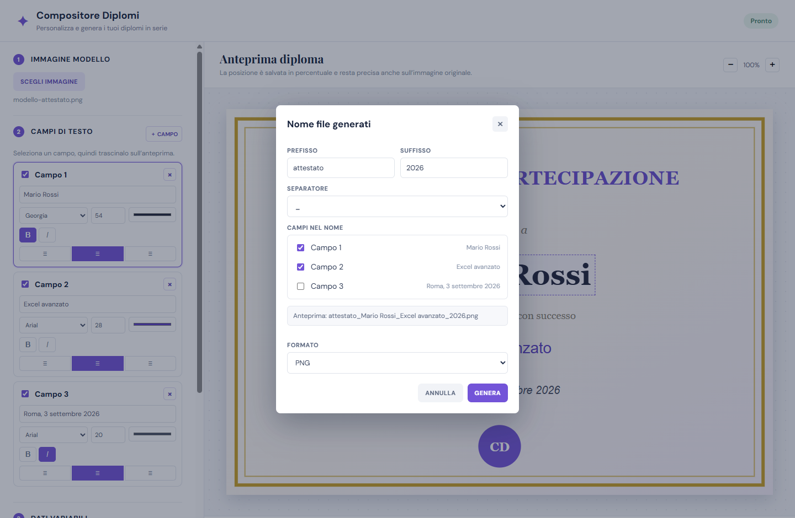

# Compositore Diplomi

Applicazione desktop Windows per creare in batch immagini di diplomi o attestati personalizzati a partire da un modello grafico e da un elenco di partecipanti.

## Anteprima


La maschera di generazione permette di comporre il nome dei file con prefisso, suffisso, campi
e separatore, e di scegliere il formato di uscita:



## Funzionalità

- Importa un modello immagine in formato PNG, JPG o WebP.
- Configura un numero libero di campi di testo: posizione, font, grassetto, corsivo, dimensione, colore e allineamento.
- Posiziona i campi trascinandoli direttamente sull'anteprima.
- Importa i dati da CSV o Excel (`.xlsx` e `.xls`).
- Gestisce i ritorni a capo nei campi importati e li mantiene nelle immagini PNG generate.
- Esporta un'immagine per ogni riga di dati, con nome file componibile e non duplicato.
- Sceglie il formato di uscita tra PNG (default) e JPG, con compressione bassa, media o alta.
- Scarica dall'app un modello CSV o Excel pronto da compilare.

## Uso

1. Seleziona l'immagine modello.
2. Aggiungi o rimuovi i campi desiderati, configurali e trascinali sull'anteprima per definirne la posizione.
3. Importa il file dati oppure scarica uno dei modelli predisposti nell'app.
4. Scegli la cartella di destinazione.
5. Premi **GENERA IMMAGINI** e scegli prefisso, suffisso, campi e separatore per il nome dei file.

La maschera di generazione usa `campo1` come default, ma puoi aggiungere un prefisso, un
suffisso e uno o più campi al nome del file, scegliendo come separarli: spazio, trattino o
underscore. Se un valore è vuoto viene saltato; se non rimane alcun valore viene generato un
nome automatico.

In fondo alla stessa maschera scegli il formato dei file generati. Il default è PNG, che
conserva l'eventuale trasparenza del modello. Selezionando JPG compare uno slider per la
compressione: **bassa** produce file più grandi con la massima fedeltà, **media** è un
compromesso, **alta** genera file più leggeri ma può lasciare aloni attorno ai bordi del
testo. Il JPG non supporta la trasparenza, quindi le aree trasparenti del modello vengono
appiattite su sfondo bianco.

## Formato dei dati

Il file CSV o Excel deve contenere nella prima riga le intestazioni delle colonne. L'app usa
l'ordine delle colonne e adatta automaticamente il numero di campi visualizzati al numero di
campi importati. I modelli scaricati dall'app usano le intestazioni `campo1`, `campo2`, ecc.

Per inserire un testo su più righe nella stessa area del diploma, aggiungi un ritorno a capo
nella cella: in Excel usa `Alt+Invio`; in un CSV il valore deve rimanere tra virgolette. Il
ritorno a capo viene mantenuto sia nell'anteprima sia nel PNG generato.

```csv
campo1,campo2
Mario Rossi,Corso di Excel
Giulia Bianchi,Corso di Excel
```

## Scarica l'applicazione

Nella pagina [Releases](https://github.com/scarulez/compositore-diplomi/releases/latest)
sono disponibili entrambe le versioni per Windows:

- **Setup**, per installare normalmente l'applicazione.
- **Portable**, da avviare direttamente senza installazione.

Per utilizzare una delle versioni pubblicate non è necessario installare Node.js o scaricare
il codice sorgente.

## Sviluppo e verifica manuale

Questa sezione è destinata a chi vuole eseguire l'app dai sorgenti, controllarne il codice o
generare personalmente i pacchetti Windows.

### Requisiti

- Windows 10 o successivo.
- [Node.js](https://nodejs.org/) LTS.

### Avvio dai sorgenti

```powershell
npm install
npm start
```

### Creazione dei pacchetti Windows

Dalla root del progetto esegui lo script PowerShell, che pulisce `dist` e produce sia setup
sia portable:

```powershell
.\build.ps1
```

Per conservare gli artefatti esistenti nella cartella `dist`:

```powershell
.\build.ps1 -KeepPrevious
```

In alternativa:

```powershell
npm run package
```

L'installer NSIS viene generato nella cartella `dist`. Per creare un eseguibile portabile:

```powershell
npm run package:portable
```

Anche l'eseguibile portabile viene generato nella cartella `dist`. Il comando
`npm run package` genera insieme sia il setup sia il portable.

Gli artefatti di build non sono versionati.
